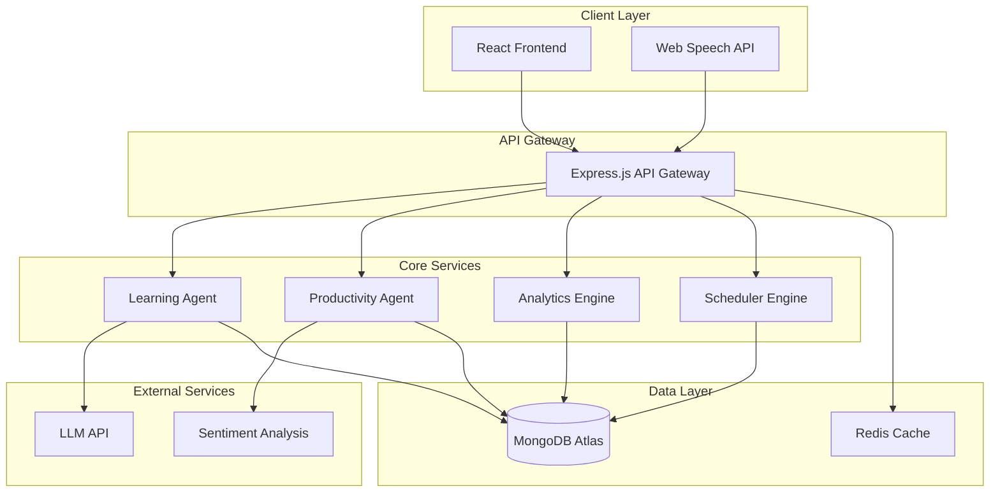
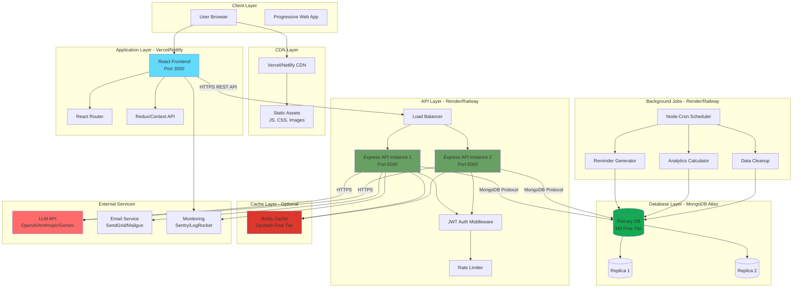
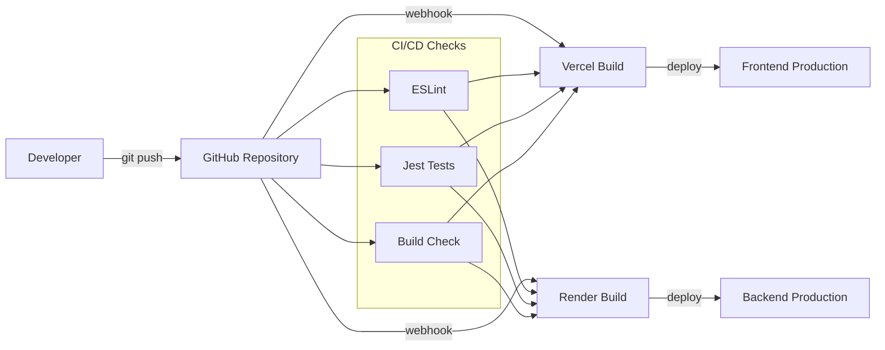

# Design Document: DualMind AI

## Overview

DualMind AI is a full-stack adaptive learning and productivity platform that combines AI-powered tutoring with behavioral analytics. The system uses a modular architecture with five core components:

1. **Learning Agent**: Handles educational queries, quiz generation, and study plan creation
2. **Productivity Agent**: Manages tasks, deadlines, and activity tracking
3. **Behavioral Analytics Engine**: Calculates burnout risk, discipline scores, and productivity trends
4. **Scheduler Engine**: Generates reminders and adapts schedules based on behavioral patterns
5. **Interaction Layer**: Provides text and voice interfaces for user communication

The platform targets college students, competitive exam aspirants, and self-learners, providing context-aware mentoring and proactive behavioral insights to prevent burnout and maintain consistent productivity.

## Architecture

### System Architecture



### Technology Stack

**Frontend:**
- React.js 18+ with functional components and hooks
- Tailwind CSS for styling
- Axios for HTTP requests
- Chart.js for data visualization
- Web Speech API for voice input/output

**Backend:**
- Node.js 18+ with Express.js
- JWT for authentication
- bcrypt for password hashing
- MongoDB driver for database operations
- Node-cron for scheduled tasks

**Database:**
- MongoDB Atlas (free tier: 512MB storage)
- Collections: users, tasks, mood_logs, quiz_results, study_plans, conversations

**External APIs:**
- LLM API (OpenAI/Anthropic/Gemini) for AI responses
- Sentiment analysis library (sentiment.js or compromise)

**Deployment:**
- Frontend: Vercel/Netlify (free tier)
- Backend: Render/Railway (free tier)
- Database: MongoDB Atlas (free tier)

### Deployment Architecture



### Cloud Infrastructure Details

**Frontend Hosting (Vercel/Netlify):**
- Automatic HTTPS with SSL certificates
- Global CDN distribution (150+ edge locations)
- Automatic deployments from Git
- Environment variables for API endpoints
- Build optimization and caching
- Free tier: 100GB bandwidth/month

**Backend Hosting (Render/Railway):**
- Container-based deployment (Docker)
- Automatic scaling (horizontal)
- Health checks and auto-restart
- Environment variable management
- Free tier: 750 hours/month (Render), $5 credit/month (Railway)
- Region: US East (primary) or EU West

**Database (MongoDB Atlas):**
- M0 Free Tier: 512MB storage, shared RAM
- 3-node replica set for high availability
- Automatic backups (point-in-time recovery)
- Network isolation with IP whitelisting
- Connection pooling (max 100 connections)
- Region: Same as backend for low latency

**Optional Cache (Upstash Redis):**
- Serverless Redis with REST API
- Free tier: 10,000 commands/day
- Used for: LLM response caching, session storage, rate limiting
- Global replication for low latency

**External Services:**
- LLM API: OpenAI (GPT-4o-mini), Anthropic (Claude), or Gemini
- Email: SendGrid (100 emails/day free) or Mailgun
- Monitoring: Sentry (5K errors/month free) or LogRocket
- Analytics: Google Analytics or Mixpanel

### Infrastructure as Code (Optional)

```yaml
# docker-compose.yml for local development
version: '3.8'
services:
  frontend:
    build: ./frontend
    ports:
      - "3000:3000"
    environment:
      - REACT_APP_API_URL=http://localhost:5000
    volumes:
      - ./frontend:/app
      - /app/node_modules
  
  backend:
    build: ./backend
    ports:
      - "5000:5000"
    environment:
      - MONGODB_URI=mongodb://mongo:27017/dualmind
      - JWT_SECRET=dev_secret
      - LLM_API_KEY=${LLM_API_KEY}
    depends_on:
      - mongo
    volumes:
      - ./backend:/app
      - /app/node_modules
  
  mongo:
    image: mongo:7.0
    ports:
      - "27017:27017"
    volumes:
      - mongo_data:/data/db
  
  redis:
    image: redis:7-alpine
    ports:
      - "6379:6379"

volumes:
  mongo_data:
```

### Deployment Pipeline



## Components and Interfaces

### 1. API Gateway

The API Gateway serves as the entry point for all client requests, handling authentication, routing, and rate limiting.

**Endpoints:**

```
Authentication:
POST   /api/auth/register
POST   /api/auth/login
POST   /api/auth/logout
POST   /api/auth/reset-password

Learning Agent:
POST   /api/learning/ask
POST   /api/learning/quiz/generate
POST   /api/learning/quiz/submit
GET    /api/learning/mastery
POST   /api/learning/study-plan
GET    /api/learning/history

Productivity Agent:
POST   /api/tasks
GET    /api/tasks
PUT    /api/tasks/:id
DELETE /api/tasks/:id
POST   /api/mood-log
GET    /api/mood-logs
POST   /api/activity-log

Analytics:
GET    /api/analytics/bri
GET    /api/analytics/discipline-score
GET    /api/analytics/trends
GET    /api/analytics/consistency

Scheduler:
GET    /api/schedule
GET    /api/reminders
PUT    /api/reminders/:id/dismiss
PUT    /api/reminders/:id/snooze

Dashboard:
GET    /api/dashboard
```

**Authentication Middleware:**

```javascript
interface AuthMiddleware {
  verifyToken(token: string): Promise<UserPayload>
  requireAuth(req, res, next): void
  rateLimit(maxAttempts: number, windowMs: number): Middleware
}
```

**Request/Response Format:**

```typescript
interface APIRequest {
  headers: {
    authorization?: string
    'content-type': string
  }
  body: any
  params: Record<string, string>
  query: Record<string, string>
}

interface APIResponse {
  success: boolean
  data?: any
  error?: {
    code: string
    message: string
  }
  timestamp: string
}
```

### 2. Learning Agent

The Learning Agent handles all educational interactions using LLM integration.

**Interface:**

```typescript
interface LearningAgent {
  // Doubt resolution
  answerQuestion(userId: string, question: string, context?: string[]): Promise<Answer>
  
  // Quiz generation
  generateQuiz(userId: string, topic: string, difficulty: string, count: number): Promise<Quiz>
  evaluateQuiz(userId: string, quizId: string, answers: Answer[]): Promise<QuizResult>
  
  // Study plans
  generateStudyPlan(userId: string, topic: string, duration: number, currentMastery: number): Promise<StudyPlan>
  
  // Mastery tracking
  updateMastery(userId: string, topic: string, quizResult: QuizResult): Promise<void>
  getMasteryLevels(userId: string): Promise<TopicMastery[]>
}

interface Answer {
  id: string
  question: string
  response: string
  sources?: string[]
  timestamp: Date
  conversationId: string
}

interface Quiz {
  id: string
  topic: string
  questions: Question[]
  difficulty: string
  createdAt: Date
}

interface Question {
  id: string
  text: string
  options?: string[]
  correctAnswer: string
  difficulty: string
  explanation: string
}

interface QuizResult {
  quizId: string
  userId: string
  score: number
  totalQuestions: number
  answers: UserAnswer[]
  completedAt: Date
}

interface UserAnswer {
  questionId: string
  userAnswer: string
  correct: boolean
}

interface StudyPlan {
  id: string
  topic: string
  subtopics: Subtopic[]
  totalEstimatedHours: number
  createdAt: Date
}

interface Subtopic {
  name: string
  estimatedHours: number
  resources: string[]
  completed: boolean
}

interface TopicMastery {
  topic: string
  masteryPercentage: number
  quizzesTaken: number
  lastUpdated: Date
  needsReview: boolean
}
```

**LLM Integration:**

```typescript
interface LLMService {
  generateResponse(prompt: string, context?: string[], maxTokens?: number): Promise<string>
  generateQuestions(topic: string, count: number, difficulty: string): Promise<Question[]>
  generateStudyPlan(topic: string, duration: number, mastery: number): Promise<StudyPlan>
}

// Prompt templates
const PROMPTS = {
  answerQuestion: (question: string, context: string[]) => `
    You are an AI tutor. Answer the following question clearly and concisely.
    ${context.length > 0 ? `Previous context: ${context.join('\n')}` : ''}
    Question: ${question}
  `,
  
  generateQuiz: (topic: string, count: number, difficulty: string) => `
    Generate ${count} ${difficulty} multiple-choice questions about ${topic}.
    Format: JSON array with fields: text, options (array of 4), correctAnswer, explanation
  `,
  
  generateStudyPlan: (topic: string, duration: number, mastery: number) => `
    Create a ${duration}-hour study plan for ${topic}.
    Current mastery level: ${mastery}%
    Format: JSON with subtopics, estimatedHours, and resources
  `
}
```

**Caching Strategy:**

```typescript
interface CacheService {
  get(key: string): Promise<string | null>
  set(key: string, value: string, ttl: number): Promise<void>
  invalidate(pattern: string): Promise<void>
}

// Cache identical questions for 24 hours
const cacheKey = (question: string) => `llm:question:${hashString(question)}`
const CACHE_TTL = 24 * 60 * 60 // 24 hours
```

### 3. Productivity Agent

The Productivity Agent manages tasks, mood logging, and activity tracking.

**Interface:**

```typescript
interface ProductivityAgent {
  // Task management
  createTask(userId: string, input: string): Promise<Task>
  getTasks(userId: string, filters?: TaskFilters): Promise<Task[]>
  updateTask(userId: string, taskId: string, updates: Partial<Task>): Promise<Task>
  deleteTask(userId: string, taskId: string): Promise<void>
  
  // Mood logging
  logMood(userId: string, text: string): Promise<MoodLog>
  getMoodLogs(userId: string, days: number): Promise<MoodLog[]>
  
  // Activity logging
  logActivity(userId: string, activity: Activity): Promise<void>
  getActivities(userId: string, days: number): Promise<Activity[]>
}

interface Task {
  id: string
  userId: string
  title: string
  description?: string
  deadline: Date
  priority: 'low' | 'medium' | 'high' | 'urgent'
  status: 'pending' | 'in_progress' | 'completed' | 'overdue'
  estimatedDuration?: number // minutes
  completedAt?: Date
  createdAt: Date
  updatedAt: Date
}

interface TaskFilters {
  status?: string[]
  priority?: string[]
  dueBefore?: Date
  dueAfter?: Date
}

interface MoodLog {
  id: string
  userId: string
  text: string
  sentimentScore: number // -1 to 1
  stressKeywords: string[]
  timestamp: Date
}

interface Activity {
  id: string
  userId: string
  type: 'study' | 'work' | 'break' | 'exercise' | 'other'
  duration: number // minutes
  description?: string
  timestamp: Date
}
```

**Natural Language Task Extraction:**

```typescript
interface TaskExtractor {
  extract(input: string): ExtractedTask
}

interface ExtractedTask {
  title: string
  deadline?: Date
  priority: 'low' | 'medium' | 'high' | 'urgent'
  estimatedDuration?: number
  confidence: number
}

// Extraction patterns
const DATE_PATTERNS = {
  tomorrow: () => addDays(new Date(), 1),
  'next monday': () => nextMonday(new Date()),
  'in 3 days': (n: number) => addDays(new Date(), n),
  'dec 25': (month: string, day: number) => new Date(new Date().getFullYear(), monthIndex(month), day)
}

const PRIORITY_KEYWORDS = {
  urgent: ['urgent', 'asap', 'critical', 'emergency'],
  high: ['important', 'high priority', 'must do'],
  medium: ['should', 'need to'],
  low: ['maybe', 'if time', 'low priority']
}
```

**Sentiment Analysis:**

```typescript
interface SentimentAnalyzer {
  analyze(text: string): SentimentResult
}

interface SentimentResult {
  score: number // -1 to 1
  magnitude: number // 0 to 1
  stressKeywords: string[]
}

const STRESS_KEYWORDS = [
  'overwhelmed', 'anxious', 'stressed', 'tired', 'exhausted',
  'burnout', 'frustrated', 'worried', 'pressure', 'deadline'
]
```

### 4. Behavioral Analytics Engine

The Analytics Engine calculates behavioral metrics and identifies trends.

**Interface:**

```typescript
interface AnalyticsEngine {
  // Burnout Risk Index
  calculateBRI(userId: string): Promise<BRIResult>
  
  // Discipline Score
  calculateDisciplineScore(userId: string, days: number): Promise<DisciplineScore>
  
  // Consistency tracking
  updateConsistencyStreak(userId: string): Promise<number>
  getConsistencyStreak(userId: string): Promise<number>
  
  // Trends
  calculateTrends(userId: string, period: 'daily' | 'weekly' | 'monthly'): Promise<Trends>
  identifyPatterns(userId: string): Promise<Pattern[]>
}

interface BRIResult {
  score: number // 0-100
  level: 'low' | 'moderate' | 'high'
  components: {
    sentimentScore: number
    pendingTasks: number
    continuousWorkHours: number
    stressKeywordFrequency: number
  }
  normalizedComponents: {
    sentimentScore: number
    pendingTasks: number
    continuousWorkHours: number
    stressKeywordFrequency: number
  }
  timestamp: Date
}

interface DisciplineScore {
  score: number // 0-100
  completedTasks: number
  totalTasks: number
  adjustedScore: number // with streak multiplier
  period: string
  timestamp: Date
}

interface Trends {
  bri: DataPoint[]
  disciplineScore: DataPoint[]
  taskCompletion: DataPoint[]
  moodTrend: DataPoint[]
}

interface DataPoint {
  date: Date
  value: number
}

interface Pattern {
  type: 'productivity_peak' | 'productivity_dip' | 'stress_pattern' | 'completion_pattern'
  description: string
  confidence: number
  recommendation: string
}
```

**BRI Calculation Formula:**

```
BRI = (0.4 × S_norm) + (0.3 × P_norm) + (0.2 × W_norm) + (0.1 × K_norm)

Where:
- S_norm = Normalized sentiment score (0-100)
  - Raw sentiment: -1 to 1
  - Normalization: (1 - sentiment) × 50
  - Inverted so negative sentiment = higher BRI

- P_norm = Normalized pending tasks (0-100)
  - Raw: count of pending/overdue tasks
  - Normalization: min(pendingTasks / 20, 1) × 100
  - Cap at 20 tasks for normalization

- W_norm = Normalized continuous work hours (0-100)
  - Raw: hours worked without break
  - Normalization: min(continuousHours / 6, 1) × 100
  - Cap at 6 hours for normalization

- K_norm = Normalized stress keyword frequency (0-100)
  - Raw: count of stress keywords in recent mood logs
  - Normalization: min(keywordCount / 10, 1) × 100
  - Cap at 10 keywords for normalization

Risk Levels:
- Low: 0-40
- Moderate: 40-70
- High: 70-100
```

**Discipline Score Calculation:**

```
DS = (Completed_Tasks / Total_Assigned_Tasks) × 100

Adjusted_DS = DS × (1 + (Consistency_Streak / 100))

Where:
- Completed_Tasks: tasks marked complete in rolling 7-day window
- Total_Assigned_Tasks: all tasks created in rolling 7-day window
- Consistency_Streak: consecutive days with at least 1 completed task
- Streak multiplier caps at 2.0 (100-day streak = 100% bonus)

Example:
- 15 completed / 20 total = 75% DS
- 14-day streak = 14% multiplier
- Adjusted_DS = 75 × 1.14 = 85.5%
```

**Consistency Streak Logic:**

```typescript
function updateConsistencyStreak(userId: string, date: Date): number {
  const yesterday = subtractDays(date, 1)
  const completedToday = hasCompletedTasks(userId, date)
  const completedYesterday = hasCompletedTasks(userId, yesterday)
  const currentStreak = getConsistencyStreak(userId)
  
  if (completedToday) {
    if (completedYesterday || currentStreak === 0) {
      return currentStreak + 1
    } else {
      return 1 // Reset and start new streak
    }
  } else {
    if (!isToday(date)) {
      return 0 // Day passed without completion, reset
    }
    return currentStreak // Day not over yet
  }
}
```

### 5. Scheduler Engine

The Scheduler Engine generates reminders and adapts schedules based on behavioral data.

**Interface:**

```typescript
interface SchedulerEngine {
  // Reminder generation
  generateReminders(task: Task): Promise<Reminder[]>
  getActiveReminders(userId: string): Promise<Reminder[]>
  dismissReminder(userId: string, reminderId: string): Promise<void>
  snoozeReminder(userId: string, reminderId: string, duration: number): Promise<void>
  
  // Adaptive scheduling
  generateSchedule(userId: string, date: Date): Promise<Schedule>
  insertBreaks(userId: string, schedule: Schedule, bri: number): Promise<Schedule>
  reorderTasks(userId: string, tasks: Task[], bri: number, ds: number): Promise<Task[]>
}

interface Reminder {
  id: string
  userId: string
  taskId: string
  type: '24h' | '6h' | '1h' | 'custom'
  triggerTime: Date
  status: 'pending' | 'triggered' | 'dismissed' | 'snoozed'
  message: string
  createdAt: Date
}

interface Schedule {
  userId: string
  date: Date
  slots: ScheduleSlot[]
  breaks: Break[]
  totalWorkHours: number
  totalBreakHours: number
}

interface ScheduleSlot {
  startTime: Date
  endTime: Date
  task: Task
  type: 'work' | 'break'
}

interface Break {
  startTime: Date
  duration: number // minutes
  reason: 'high_bri' | 'continuous_work' | 'scheduled'
}
```

**Reminder Generation Logic:**

```typescript
function generateReminders(task: Task): Reminder[] {
  const reminders: Reminder[] = []
  const deadline = task.deadline
  
  // 24 hours before
  if (isFuture(subtractHours(deadline, 24))) {
    reminders.push({
      type: '24h',
      triggerTime: subtractHours(deadline, 24),
      message: `Reminder: "${task.title}" is due in 24 hours`
    })
  }
  
  // 6 hours before
  if (isFuture(subtractHours(deadline, 6))) {
    reminders.push({
      type: '6h',
      triggerTime: subtractHours(deadline, 6),
      message: `Reminder: "${task.title}" is due in 6 hours`
    })
  }
  
  // 1 hour before
  if (isFuture(subtractHours(deadline, 1))) {
    reminders.push({
      type: '1h',
      triggerTime: subtractHours(deadline, 1),
      message: `Urgent: "${task.title}" is due in 1 hour!`
    })
  }
  
  return reminders
}
```

**Adaptive Break Insertion:**

```typescript
function insertBreaks(schedule: Schedule, bri: number, continuousWorkHours: number): Schedule {
  const breaks: Break[] = []
  
  // High BRI: insert 15-min breaks
  if (bri > 70) {
    const workSlots = schedule.slots.filter(s => s.type === 'work')
    for (let i = 0; i < workSlots.length; i += 2) {
      breaks.push({
        startTime: workSlots[i].endTime,
        duration: 15,
        reason: 'high_bri'
      })
    }
  }
  
  // Continuous work: insert 30-min break
  if (continuousWorkHours > 3) {
    const midpoint = schedule.slots[Math.floor(schedule.slots.length / 2)]
    breaks.push({
      startTime: midpoint.endTime,
      duration: 30,
      reason: 'continuous_work'
    })
  }
  
  // Merge breaks into schedule
  return mergeBreaksIntoSchedule(schedule, breaks)
}
```

**Task Reordering Logic:**

```typescript
function reorderTasks(tasks: Task[], bri: number, ds: number): Task[] {
  let sortedTasks = [...tasks]
  
  // High BRI: prioritize easier/shorter tasks
  if (bri > 70) {
    sortedTasks.sort((a, b) => {
      const durationA = a.estimatedDuration || 60
      const durationB = b.estimatedDuration || 60
      return durationA - durationB // Shorter tasks first
    })
  }
  
  // Low DS: prioritize high-impact tasks
  else if (ds < 50) {
    sortedTasks.sort((a, b) => {
      const priorityWeight = { urgent: 4, high: 3, medium: 2, low: 1 }
      return priorityWeight[b.priority] - priorityWeight[a.priority]
    })
  }
  
  // Normal: sort by deadline and priority
  else {
    sortedTasks.sort((a, b) => {
      const deadlineDiff = a.deadline.getTime() - b.deadline.getTime()
      if (Math.abs(deadlineDiff) < 24 * 60 * 60 * 1000) { // Same day
        const priorityWeight = { urgent: 4, high: 3, medium: 2, low: 1 }
        return priorityWeight[b.priority] - priorityWeight[a.priority]
      }
      return deadlineDiff
    })
  }
  
  return sortedTasks
}
```

### 6. Interaction Layer

The Interaction Layer handles text and voice input/output.

**Interface:**

```typescript
interface InteractionLayer {
  // Text processing
  processTextInput(userId: string, text: string): Promise<Response>
  
  // Voice processing
  transcribeAudio(audioBlob: Blob): Promise<string>
  synthesizeSpeech(text: string): Promise<AudioBuffer>
  
  // Routing
  routeToAgent(input: string): 'learning' | 'productivity' | 'analytics' | 'scheduler'
}

interface Response {
  text: string
  type: 'answer' | 'confirmation' | 'error' | 'clarification'
  data?: any
  suggestions?: string[]
}
```

**Intent Classification:**

```typescript
function routeToAgent(input: string): string {
  const learningKeywords = ['explain', 'what is', 'how does', 'quiz', 'test', 'study plan', 'learn']
  const productivityKeywords = ['task', 'todo', 'deadline', 'remind', 'schedule', 'mood', 'feeling']
  const analyticsKeywords = ['burnout', 'discipline', 'score', 'trend', 'progress', 'stats']
  
  const lowerInput = input.toLowerCase()
  
  if (learningKeywords.some(kw => lowerInput.includes(kw))) {
    return 'learning'
  } else if (productivityKeywords.some(kw => lowerInput.includes(kw))) {
    return 'productivity'
  } else if (analyticsKeywords.some(kw => lowerInput.includes(kw))) {
    return 'analytics'
  } else {
    return 'learning' // Default to learning agent
  }
}
```

**Voice Integration:**

```typescript
// Frontend: Web Speech API
interface VoiceService {
  startListening(): void
  stopListening(): void
  speak(text: string): void
}

// Implementation using Web Speech API
const recognition = new webkitSpeechRecognition()
recognition.continuous = false
recognition.interimResults = false
recognition.lang = 'en-US'

recognition.onresult = (event) => {
  const transcript = event.results[0][0].transcript
  processTextInput(transcript)
}

const synthesis = window.speechSynthesis
function speak(text: string) {
  const utterance = new SpeechSynthesisUtterance(text)
  utterance.lang = 'en-US'
  synthesis.speak(utterance)
}
```

## Data Models

### MongoDB Collections

**users:**
```typescript
interface User {
  _id: ObjectId
  email: string // unique, indexed
  passwordHash: string
  name: string
  preferences: {
    reminderTiming: number[] // hours before deadline
    voiceEnabled: boolean
    language: string
    theme: 'light' | 'dark'
  }
  consistencyStreak: number
  createdAt: Date
  updatedAt: Date
  lastLoginAt: Date
}
```

**tasks:**
```typescript
interface TaskDocument {
  _id: ObjectId
  userId: ObjectId // indexed
  title: string
  description?: string
  deadline: Date // indexed
  priority: 'low' | 'medium' | 'high' | 'urgent'
  status: 'pending' | 'in_progress' | 'completed' | 'overdue'
  estimatedDuration?: number
  completedAt?: Date
  createdAt: Date // indexed
  updatedAt: Date
  deleted: boolean
  deletedAt?: Date
}

// Indexes
db.tasks.createIndex({ userId: 1, deadline: 1 })
db.tasks.createIndex({ userId: 1, status: 1 })
db.tasks.createIndex({ userId: 1, createdAt: -1 })
```

**mood_logs:**
```typescript
interface MoodLogDocument {
  _id: ObjectId
  userId: ObjectId // indexed
  text: string
  sentimentScore: number
  stressKeywords: string[]
  timestamp: Date // indexed
}

// Indexes
db.mood_logs.createIndex({ userId: 1, timestamp: -1 })
```

**activity_logs:**
```typescript
interface ActivityLogDocument {
  _id: ObjectId
  userId: ObjectId // indexed
  type: 'study' | 'work' | 'break' | 'exercise' | 'other'
  duration: number
  description?: string
  timestamp: Date // indexed
}

// Indexes
db.activity_logs.createIndex({ userId: 1, timestamp: -1 })
```

**quiz_results:**
```typescript
interface QuizResultDocument {
  _id: ObjectId
  userId: ObjectId // indexed
  quizId: string
  topic: string // indexed
  score: number
  totalQuestions: number
  answers: {
    questionId: string
    userAnswer: string
    correct: boolean
  }[]
  completedAt: Date
}

// Indexes
db.quiz_results.createIndex({ userId: 1, topic: 1 })
db.quiz_results.createIndex({ userId: 1, completedAt: -1 })
```

**study_plans:**
```typescript
interface StudyPlanDocument {
  _id: ObjectId
  userId: ObjectId // indexed
  topic: string
  subtopics: {
    name: string
    estimatedHours: number
    resources: string[]
    completed: boolean
    completedAt?: Date
  }[]
  totalEstimatedHours: number
  progress: number // 0-100
  createdAt: Date
  updatedAt: Date
}

// Indexes
db.study_plans.createIndex({ userId: 1, createdAt: -1 })
```

**conversations:**
```typescript
interface ConversationDocument {
  _id: ObjectId
  userId: ObjectId // indexed
  messages: {
    role: 'user' | 'assistant'
    content: string
    timestamp: Date
  }[]
  topic?: string
  createdAt: Date
  updatedAt: Date
}

// Indexes
db.conversations.createIndex({ userId: 1, updatedAt: -1 })
```

**reminders:**
```typescript
interface ReminderDocument {
  _id: ObjectId
  userId: ObjectId // indexed
  taskId: ObjectId
  type: '24h' | '6h' | '1h' | 'custom'
  triggerTime: Date // indexed
  status: 'pending' | 'triggered' | 'dismissed' | 'snoozed'
  message: string
  snoozedUntil?: Date
  createdAt: Date
}

// Indexes
db.reminders.createIndex({ userId: 1, status: 1 })
db.reminders.createIndex({ triggerTime: 1, status: 1 })
```

**analytics_cache:**
```typescript
interface AnalyticsCacheDocument {
  _id: ObjectId
  userId: ObjectId // indexed, unique
  bri: {
    score: number
    level: string
    components: object
    calculatedAt: Date
  }
  disciplineScore: {
    score: number
    adjustedScore: number
    calculatedAt: Date
  }
  lastUpdated: Date
}

// Indexes
db.analytics_cache.createIndex({ userId: 1 }, { unique: true })
```

### Database Optimization

**Query Patterns:**

1. **Frequent Queries:**
   - Get user's pending tasks: `db.tasks.find({ userId, status: 'pending' }).sort({ deadline: 1 })`
   - Get recent mood logs: `db.mood_logs.find({ userId }).sort({ timestamp: -1 }).limit(30)`
   - Get topic mastery: `db.quiz_results.aggregate([{ $match: { userId } }, { $group: { _id: '$topic', avgScore: { $avg: '$score' } } }])`

2. **Caching Strategy:**
   - Cache BRI and DS calculations for 5 minutes
   - Cache LLM responses for identical questions (24 hours)
   - Cache user profile data in memory (session duration)

3. **Data Retention:**
   - Keep all user data indefinitely (user can request deletion)
   - Archive completed tasks older than 90 days to separate collection
   - Limit conversation history to last 50 messages per conversation

## Correctness Properties

*A property is a characteristic or behavior that should hold true across all valid executions of a system—essentially, a formal statement about what the system should do. Properties serve as the bridge between human-readable specifications and machine-verifiable correctness guarantees.*

### Authentication and Security Properties

**Property 1: User Registration Creates Valid Accounts**
*For any* valid registration credentials (email, password, name), creating a user account should result in a retrievable user with matching email and name, and an encrypted password.
**Validates: Requirements 1.1, 1.5**

**Property 2: Profile Update Round-Trip**
*For any* user and valid profile updates, updating the profile then retrieving it should return the updated values.
**Validates: Requirements 1.4**

**Property 3: Password Encryption Invariant**
*For any* user in the database, the password field should never contain plaintext—it must be a bcrypt hash.
**Validates: Requirements 1.5**

**Property 4: Authentication Token Validity**
*For any* valid login credentials, authentication should generate a valid JWT token that can be verified to extract the correct user ID.
**Validates: Requirements 1.2**

### Learning Agent Properties

**Property 5: Question History Persistence**
*For any* user question submitted to the Learning Agent, the question and response should appear in the user's learning history immediately after generation.
**Validates: Requirements 2.3**

**Property 6: Quiz Score Calculation**
*For any* quiz submission, the calculated score should equal (number of correct answers / total questions) × 100.
**Validates: Requirements 3.2**

**Property 7: Quiz Result Storage Round-Trip**
*For any* completed quiz, storing the result then retrieving it should return all metadata including quiz ID, topic, score, answers, and timestamp.
**Validates: Requirements 3.5**

**Property 8: Topic Mastery Calculation**
*For any* user and topic, the mastery percentage should equal the average score of all quizzes taken for that topic.
**Validates: Requirements 4.2**

**Property 9: Topic Mastery Update on Quiz Completion**
*For any* quiz completion, the mastery score for the associated topic should be recalculated and updated immediately.
**Validates: Requirements 3.3, 4.1**

**Property 10: Low Mastery Flagging**
*For any* topic with mastery score below 60%, the topic should be flagged as needing review.
**Validates: Requirements 4.4**

### Task Management Properties

**Property 11: Task Unique ID Assignment**
*For any* two tasks created by any user, they should have different unique identifiers.
**Validates: Requirements 6.2**

**Property 12: Task Completion State Transition**
*For any* task marked as complete, the task status should change to 'completed' and the completedAt timestamp should be set to the current time.
**Validates: Requirements 6.3**

**Property 13: Task Soft Delete**
*For any* deleted task, it should not appear in the active task list but should still exist in the database with deleted=true for analytics.
**Validates: Requirements 6.5**

**Property 14: Task Sorting by Deadline and Priority**
*For any* user's task list, tasks should be sorted first by deadline (earliest first), then by priority (urgent > high > medium > low) for tasks with the same deadline.
**Validates: Requirements 6.4**

**Property 15: Urgent Task Marking**
*For any* task with a deadline within 24 hours of the current time, the task should be marked as urgent.
**Validates: Requirements 7.1**

**Property 16: Overdue Task Flagging**
*For any* task with a deadline in the past and status not 'completed', the task should be flagged as overdue.
**Validates: Requirements 7.2**

### Mood and Activity Tracking Properties

**Property 17: Sentiment Analysis on Mood Logs**
*For any* mood log entry, the system should calculate and store a sentiment score between -1 and 1.
**Validates: Requirements 8.1**

**Property 18: Stress Keyword Detection**
*For any* mood log containing stress keywords (overwhelmed, anxious, stressed, tired, exhausted, burnout, frustrated, worried, pressure, deadline), those keywords should be identified and stored in the stressKeywords array.
**Validates: Requirements 8.4**

**Property 19: Activity Log Round-Trip**
*For any* activity log entry, storing it then retrieving it should return the same activity type, duration, description, and timestamp.
**Validates: Requirements 8.2**

### Behavioral Analytics Properties

**Property 20: BRI Calculation Formula**
*For any* user data, the BRI should equal (0.4 × S_norm) + (0.3 × P_norm) + (0.2 × W_norm) + (0.1 × K_norm), where all components are normalized to 0-100 scale.
**Validates: Requirements 9.1**

**Property 21: BRI Component Normalization**
*For any* BRI calculation, all four components (sentiment, pending tasks, continuous work hours, stress keywords) should be normalized to values between 0 and 100 before applying the formula.
**Validates: Requirements 9.2**

**Property 22: BRI Risk Level Classification**
*For any* BRI score, the risk level should be 'low' if BRI < 40, 'moderate' if 40 ≤ BRI ≤ 70, and 'high' if BRI > 70.
**Validates: Requirements 9.3, 9.4, 9.5**

**Property 23: Discipline Score Calculation**
*For any* user, the DS should equal (completed tasks in last 7 days / total tasks in last 7 days) × 100.
**Validates: Requirements 10.1, 10.2**

**Property 24: Discipline Score Immediate Update**
*For any* task completion, the user's discipline score should be recalculated immediately and reflect the newly completed task.
**Validates: Requirements 10.3**

**Property 25: Consistency Streak Increment**
*For any* user who completes at least one task on a given day, if they also completed at least one task the previous day (or streak is 0), the consistency streak should increment by 1.
**Validates: Requirements 11.1**

**Property 26: Consistency Streak Reset**
*For any* user who completes zero tasks on a given day (after the day has ended), the consistency streak should reset to 0.
**Validates: Requirements 11.2**

**Property 27: Adjusted Discipline Score with Streak Multiplier**
*For any* user, the adjusted DS should equal DS × (1 + (consistency_streak / 100)).
**Validates: Requirements 11.3**

### Scheduler Engine Properties

**Property 28: Date Format Parsing**
*For any* common date format input ("tomorrow", "next Monday", "Dec 25", "in 3 days"), the system should parse it to the correct Date object.
**Validates: Requirements 13.2**

**Property 29: Priority Keyword Recognition**
*For any* task description containing priority keywords ("urgent", "important", "high priority", "low priority"), the system should extract the correct priority level.
**Validates: Requirements 13.3**

**Property 30: Reminder Generation for Tasks**
*For any* task created with a deadline more than 24 hours in the future, the system should generate three reminders: 24 hours before, 6 hours before, and 1 hour before the deadline.
**Validates: Requirements 14.1**

**Property 31: Reminder Cancellation on Task Completion**
*For any* task that is marked as complete, all pending reminders associated with that task should be cancelled (status changed to 'dismissed' or removed).
**Validates: Requirements 14.4**

**Property 32: Break Insertion for High BRI**
*For any* schedule where the user's BRI exceeds 70, the system should insert 15-minute break slots between work sessions.
**Validates: Requirements 15.1**

**Property 33: No Task-Break Overlap**
*For any* generated schedule, no task time slot should overlap with any break time slot.
**Validates: Requirements 15.3**

**Property 34: Task Reordering for High BRI**
*For any* task list when BRI > 70, tasks should be reordered with shorter estimated duration tasks appearing before longer ones.
**Validates: Requirements 16.1**

**Property 35: Task Reordering for Low DS**
*For any* task list when DS < 50, tasks should be reordered with higher priority tasks appearing before lower priority ones.
**Validates: Requirements 16.2**

### Interaction Layer Properties

**Property 36: Input Routing to Correct Agent**
*For any* user input containing learning keywords (explain, what is, how does, quiz, test, study plan, learn), the system should route it to the Learning Agent; for productivity keywords (task, todo, deadline, remind, schedule, mood, feeling), route to Productivity Agent.
**Validates: Requirements 17.3**

**Property 37: Conversation History Persistence**
*For any* user message and agent response, both should be stored in the conversation history with correct roles ('user' and 'assistant') and timestamps.
**Validates: Requirements 17.5**

**Property 38: Multi-line Input Support**
*For any* text input containing newline characters, the system should process the entire multi-line input without truncation.
**Validates: Requirements 17.2**

### Notification and Reminder Properties

**Property 39: Reminder Sorting by Trigger Time**
*For any* user's active reminders, they should be sorted by trigger time in ascending order (earliest first).
**Validates: Requirements 20.1**

**Property 40: Reminder Dismissal**
*For any* reminder that is dismissed by the user, it should no longer appear in the active reminders list.
**Validates: Requirements 20.3**

**Property 41: Reminder Snooze**
*For any* reminder that is snoozed for N minutes, its trigger time should be updated to current time + N minutes, and status should be 'snoozed'.
**Validates: Requirements 20.5**

### Data Integrity Properties

**Property 42: Input Validation**
*For any* invalid input data (e.g., malformed email, negative task duration, future birth date), the system should reject it and return a validation error before attempting to persist.
**Validates: Requirements 21.3**

**Property 43: Complete User Data Retrieval**
*For any* authenticated user, retrieving their dashboard data should return their profile, all active tasks, current BRI, current DS, consistency streak, and upcoming reminders.
**Validates: Requirements 21.2**

## Error Handling

### Error Categories

**1. Authentication Errors**
- Invalid credentials: Return 401 with generic message "Invalid email or password"
- Expired token: Return 401 with "Session expired, please login again"
- Missing token: Return 401 with "Authentication required"
- Rate limit exceeded: Return 429 with "Too many login attempts, try again in 15 minutes"

**2. Validation Errors**
- Invalid input format: Return 400 with specific field errors
- Missing required fields: Return 400 with list of missing fields
- Data type mismatch: Return 400 with expected vs actual type

**3. Resource Errors**
- Not found: Return 404 with "Resource not found"
- Already exists: Return 409 with "Resource already exists"
- Permission denied: Return 403 with "You don't have permission to access this resource"

**4. External Service Errors**
- LLM API timeout: Return cached response if available, otherwise 503 with "AI service temporarily unavailable"
- LLM API quota exceeded: Return 503 with "Service temporarily unavailable, please try again later"
- Database connection failure: Retry 3 times, then return 500 with "Database error, please try again"

**5. Business Logic Errors**
- Invalid state transition: Return 400 with explanation
- Constraint violation: Return 400 with constraint details

### Error Response Format

```typescript
interface ErrorResponse {
  success: false
  error: {
    code: string // e.g., "AUTH_INVALID_CREDENTIALS"
    message: string // User-friendly message
    details?: any // Additional context (only in development)
  }
  timestamp: string
}
```

### Graceful Degradation

**LLM Service Unavailable:**
- Use cached responses for identical questions
- Provide fallback responses for common queries
- Display message: "AI service is temporarily unavailable. Cached responses may be shown."

**Database Connection Issues:**
- Retry with exponential backoff (1s, 2s, 4s)
- Use in-memory cache for read operations
- Queue write operations for retry

**Sentiment Analysis Failure:**
- Default to neutral sentiment (0.0)
- Log failure for investigation
- Continue with other analytics calculations

## Testing Strategy

### Dual Testing Approach

DualMind AI will use both unit testing and property-based testing to ensure comprehensive coverage:

**Unit Tests:**
- Specific examples and edge cases
- Integration points between modules
- Error conditions and boundary cases
- Mock external services (LLM API, database)

**Property-Based Tests:**
- Universal properties across all inputs
- Randomized input generation (minimum 100 iterations per test)
- Verify correctness properties from design document
- Each test tagged with: **Feature: dualmind-ai, Property {number}: {property_text}**

### Testing Framework Selection

**Backend (Node.js):**
- Unit tests: Jest
- Property-based tests: fast-check
- API testing: Supertest
- Database testing: mongodb-memory-server

**Frontend (React):**
- Unit tests: Jest + React Testing Library
- Property-based tests: fast-check
- Component testing: React Testing Library
- E2E testing: Playwright (optional)

### Property-Based Testing Configuration

Each property test must run a minimum of 100 iterations and be tagged with the corresponding design property. Example:

```javascript
// Feature: dualmind-ai, Property 6: Quiz Score Calculation
describe('Quiz Score Calculation', () => {
  it('should calculate score as (correct/total) × 100 for any quiz', () => {
    fc.assert(
      fc.property(
        fc.array(fc.boolean(), { minLength: 1, maxLength: 20 }),
        (answers) => {
          const correctCount = answers.filter(a => a).length
          const totalCount = answers.length
          const expectedScore = (correctCount / totalCount) * 100
          
          const calculatedScore = calculateQuizScore(answers)
          
          expect(calculatedScore).toBeCloseTo(expectedScore, 2)
        }
      ),
      { numRuns: 100 }
    )
  })
})
```

### Test Coverage Requirements

**Minimum Coverage Targets:**
- Unit test coverage: 80% of code
- Property test coverage: All 43 correctness properties
- Integration test coverage: All API endpoints
- Critical paths: 100% coverage (authentication, BRI calculation, DS calculation)

### Testing Priorities

**Priority 1 (Must Test):**
- Authentication and authorization
- BRI and DS calculations
- Task creation and management
- Quiz score calculation
- Reminder generation
- Data persistence and retrieval

**Priority 2 (Should Test):**
- Natural language task extraction
- Date parsing
- Sentiment analysis
- Schedule generation
- Break insertion logic
- Task reordering

**Priority 3 (Nice to Test):**
- UI rendering
- Voice input/output
- Real-time updates
- Performance benchmarks

## Deployment Considerations

### Environment Configuration

**Environment Variables:**
```bash
# Backend (.env)
NODE_ENV=production
PORT=3000
MONGODB_URI=mongodb+srv://...
JWT_SECRET=<random-secret>
JWT_EXPIRY=7d
LLM_API_KEY=<api-key>
LLM_API_URL=https://api.openai.com/v1
CACHE_TTL=300
RATE_LIMIT_WINDOW=900000
RATE_LIMIT_MAX=5

# Frontend (.env)
REACT_APP_API_URL=https://api.dualmind.com
REACT_APP_ENABLE_VOICE=true
```

### Free Tier Deployment

**Frontend (Vercel/Netlify):**
- Build command: `npm run build`
- Output directory: `build`
- Environment variables: Set in dashboard

**Backend (Render/Railway):**
- Build command: `npm install`
- Start command: `npm start`
- Health check endpoint: `/api/health`

**Database (MongoDB Atlas):**
- Free tier: 512MB storage
- Shared cluster (M0)
- Connection string: Use in MONGODB_URI

### Performance Optimization

**Backend:**
- Connection pooling for MongoDB
- Request caching (in-memory or Redis)
- Response compression (gzip)
- Pagination for large result sets

**Frontend:**
- Code splitting with React.lazy()
- Lazy load charts and visualizations
- Debounce user input (300ms)
- Cache API responses in localStorage

**Database:**
- Indexes on frequently queried fields
- Aggregation pipelines for complex queries
- Projection to return only needed fields
- Archive old data to reduce collection size

### Security Hardening

**Backend:**
- helmet.js for security headers
- CORS with whitelist
- Input sanitization
- Rate limiting per user
- Secure cookie flags

**Frontend:**
- JWT in httpOnly cookie
- CSRF protection
- Content sanitization
- Content Security Policy
- Client-side input validation

## Future Enhancements

**Phase 2 Features:**
- Real-time collaboration (study groups)
- Spaced repetition algorithm
- Calendar integration (Google Calendar, Outlook)
- Mobile app (React Native)
- Offline mode with sync
- Advanced analytics (heatmaps, focus tracking)
- Gamification (achievements, leaderboards)
- Social features (share plans, compete)

**Technical Improvements:**
- Microservices architecture
- WebSocket for real-time updates
- Redis for distributed caching
- Message queue for async tasks
- Full-text search (Elasticsearch)
- A/B testing framework
- Telemetry and behavior analytics

